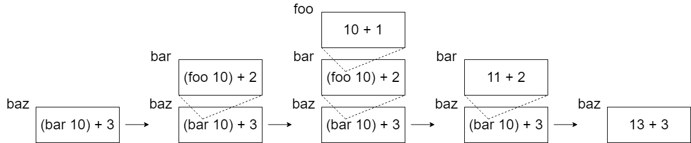
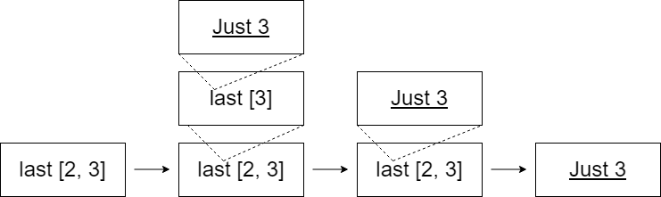
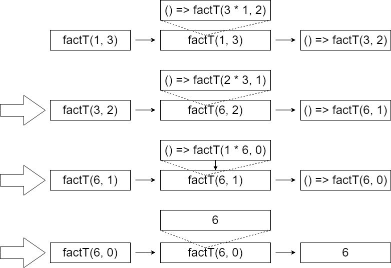

<!-- _class: lead -->

# **トランポリンによるStack safeな再帰**

## Takuma Uda


---

# 自己紹介

- 名前: 宇田拓馬
- 所属: JAIST 青木研究室 D2
- 研究内容: 形式仕様記述, 定理証明支援
- 趣味: 読書, プログラミング
- Twitter: @hennin_ltn


---

# 目次
- 再帰関数
- Stack overflow
- 末尾呼び出し最適化
- アキュムレータによる末尾再帰化
- トランポリンによる最適化
- トランポリンモナド


---

# 再帰関数

関数型の言語では通常、ループの代わりに再帰が用いられる

→ Stack overflowの問題

```c++
int fact(int n) {
  int fact = 1;
  for(int i = 1; i <= n; i++) {
    fact *= i;
  }
  return fact;
}
```

```haskell
fact :: Int -> Int
fact 0 = 1
fact n = n * fact (n - 1)
```


---

# Stack overflow

関数の呼び出しがcall stackの上限を超えたときに起こる

```haskell
foo :: Int -> Int
foo n = n + 1

bar :: Int -> Int
bar n = (foo n) + 2

baz :: Int -> Int
baz n = (bar n) + 3

baz 10
```




---

# 末尾呼び出し最適化 (Tail Call Optimization)

- コンパイラによる最適化の一つ
- 再帰によるstack overflowを防ぐため、末尾再帰をループに書き換える
- 末尾再帰とは？
  再帰の呼び出しが処理の最後に来る

```haskell
last :: [Int] -> Maybe Int
last [] = Nothing
last (x :: []) = Just x
last (x :: xs) = last xs
```




---

# アキュムレータによる末尾再帰化

途中の計算結果(状態)を引数にすることで末尾再帰化

```haskell
fact :: Int -> Int
fact 0 = 1
fact n = n * fact (n - 1)
```

```haskell
fact_acc :: Int -> Int -> Int
fact_acc acc 0 = acc
fact_acc acc n = fact_acc (n * acc) (n - 1)

fact_acc 1 10
```


---

# アキュムレータによる末尾再帰化

```haskell
fib :: Int -> Int
fib 0 = 0
fib 1 = 1
fib n = fib (n - 2) + fib (n - 1)
```

```haskell
fib_acc :: Int -> Int -> Int -> Int
fib_acc a b 0 = a
fib_acc a b n = fib_acc b (a + b) (n - 1)
```


---

# トランポリンによる最適化

末尾呼び出し最適化が仕様にない言語もある
→トランポリン化

再帰呼び出し部分を関数で包み、これをループを用いて呼び出すことでStack overflowを回避

```js
function fact_acc(acc, n) {
  return n === 0 ? acc : fact(n * acc, n - 1);
}
function factT(acc, n) {
  return n === 0 ? acc : () => fact(n * acc, n - 1);
}

function runTrampoline(t) {
  while(true) {
    if (t.constructor === Function) {
      t = t();
    } else {
      return t;
} } }
```


---

# トランポリンによる最適化




---

# トランポリン型

- トランポリン: 関数を任意回ネストしたデータ構造
  型としてどう表現する？
- 型クラス Free

```haskell
type Trampoline = Free (Function Unit)

data Free f a
  = Pure a
  | Join (f (Free f a))
```

```haskell
a :: Int
f :: Function Unit

Pure 10
Join \_ -> Pure 10
Join \_ -> (Join \_ -> Pure 10)
Join \_ -> (Join \_ -> (Join \_ -> Pure 10))
```

```haskell
f :: Function a b
f :: (->) a b
f :: a -> b
```


---

# トランポリンによる末尾再帰化

```haskell
fact_acc :: Int -> Int -> Int
fact_acc acc 0 = acc
fact_acc acc n = fact_acc (n * acc) (n - 1)

fact_trampoline :: Int -> Int -> Trampoline Int
fact_trampoline acc 0 = done acc
fact_trampoline acc n =
  wrap \_ -> fact_trampoline (n * acc) (n - 1)

runTrampoline $ fact_trampoline 1 10
```

```haskell
fib_acc :: Int -> Int -> Int -> Int
fib_acc a b 0 = a
fib_acc a b n = fib_acc b (a + b) (n - 1)

fib_trampoline :: Int -> Int -> Int -> Trampoline Int
fib_trampoline a b 0 = done a
fib_trampoline a b n = fib_acc b (a + b) (n - 1)
```


---

# モナドとしてのトランポリン

- fがFunctorであるとき, Free f aはMonadとなる
- Function aはFunctor (関数合成がmapになる)
- Monadとなると何がうれしい？
  - do記法が使える

```haskell
instance Functor (Function t) where
  map :: Function t a -> (a -> b) -> Function t b
  map f g x = (f . g) x
```

```haskell
head_trampoline :: [Int] -> Trampoline Int
tail_trampoline :: [Int] -> Trampoline Int

head_tail_trampoline :: [Int] -> Trampoline Int
head_tail_trampoline xs = do
  h <- head_trampoline xs
  l <- last_trampoline xs
  pure $ [h, l]
```